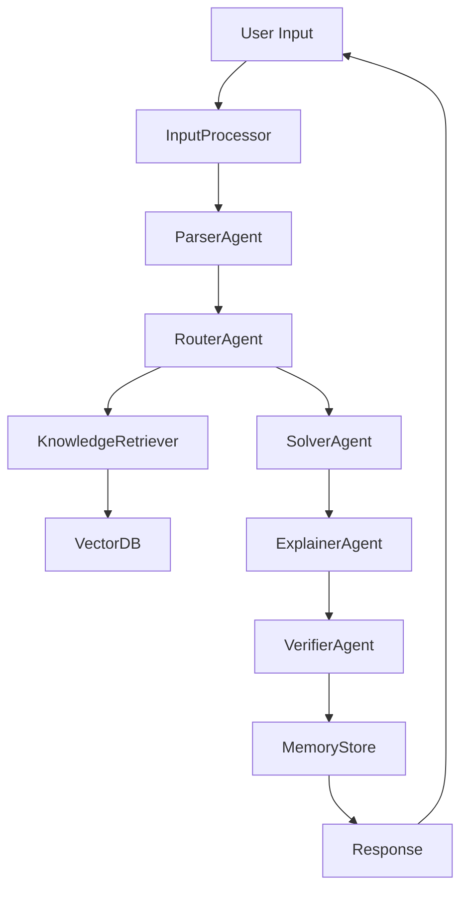
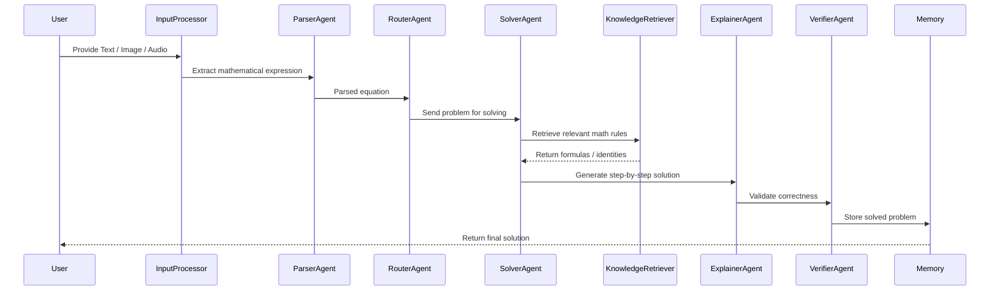
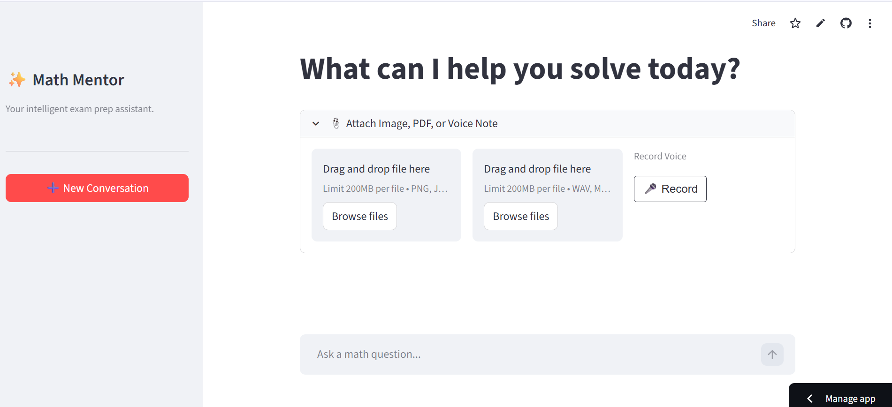
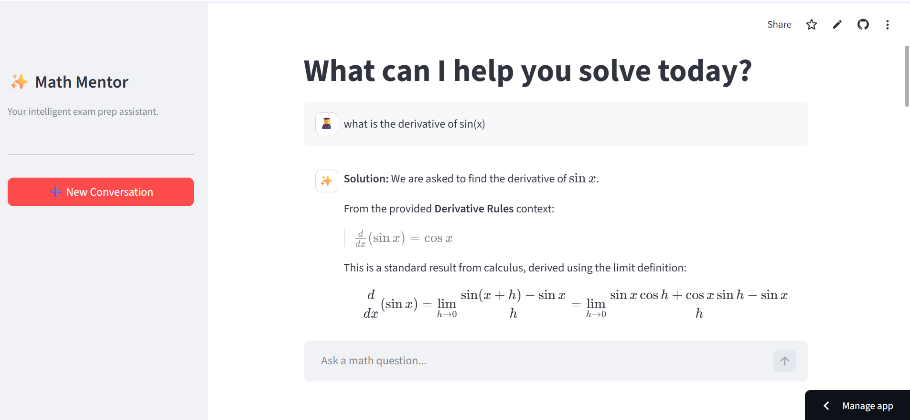

#  AI Math Mentor

<p align="center">
An Intelligent Multi-Modal AI Agent System for Solving Mathematical Problems
</p>

<p align="center">


</p>

<p align="center">

##  Live Application  
👉 https://mathmentorai-9j8c4yugzdf7guopwvwsbf.streamlit.app/

</p>

<p align="center">
AI Math Mentor solves mathematical problems from <b>text, images, and audio</b> using a multi-agent AI system with <b>memory, retrieval-augmented knowledge, and human-in-the-loop verification</b>.
</p>

---

#  Features

## Multi-Modal Input

The system supports solving mathematical problems from multiple input formats:

- ✍️ Text Input  
- 📷 Image Input (OCR)  
- 🎤 Audio Input (Speech to Text)

---

## Multi-Agent Architecture

The system uses multiple specialized AI agents that collaborate to solve problems.

| Agent | Responsibility |
|------|---------------|
Parser Agent | Extracts mathematical expressions |
Router Agent | Routes tasks between agents |
Solver Agent | Solves mathematical expressions |
Explainer Agent | Generates step-by-step explanations |
Verifier Agent | Validates solution correctness |

---

## Symbolic Mathematics

The system uses **SymPy** for symbolic math solving.

Supported problem types:

- Algebraic equations  
- Derivatives  
- Logarithmic expressions  
- Matrix operations  
- Probability problems  

---

## Retrieval Augmented Generation (RAG)

The system retrieves mathematical knowledge from a custom knowledge base.

Knowledge files include:

- algebra identities  
- derivative rules  
- logarithmic properties  
- matrix rules  
- probability rules  

Vector embeddings are stored using **ChromaDB**.

---

## Persistent Memory

Solved problems are stored in a memory database.

When similar questions appear again, the system retrieves past solutions to improve efficiency.

---

## Human-in-the-Loop (HITL)

If the AI is uncertain (especially after OCR extraction), the system allows the user to confirm or correct the equation before solving.

---

# 🌐 Live Demo

You can try the deployed application here:

👉 https://mathmentorai-9j8c4yugzdf7guopwvwsbf.streamlit.app/

The application allows users to:

- Upload handwritten math problems  
- Speak mathematical questions  
- Enter equations using text  
- Get detailed step-by-step solutions  

---

# System Architecture


---

#  Workflow

The following diagram shows how a user query moves through the system from input to final response.



---

# Project Structure

```
AI_MATH_MENTOR_AI/

agents/
  parser_agent.py
  solver_agent.py
  explainer_agent.py
  verifier_agent.py
  router_agent.py

graph/
  agent_graph.py

memory/
  memory_db.py
  memory_store.json

rag/
  knowledge_base/
    algebra_identities.txt
    derivative_rules.txt
    logarithm_rules.txt
    matrix_rules.txt
    probability_rules.txt

  vector_db/
  build_vector_db.py
  retriever.py

tools/
  audio_tool.py
  math_solver.py
  ocr_tool.py

utils/
  input_processor.py
  llm.py
  prompts.py
  schemas.py

.env
app.py
requirements.txt
```

---

# ⚙ Tech Stack

| Category | Technology |
|--------|-----------|
Frontend | Streamlit |
Agent Framework | LangGraph |
LLM Framework | LangChain |
Vector Database | ChromaDB |
Embeddings | Sentence Transformers |
Math Solver | SymPy |
OCR | EasyOCR |
Speech Recognition | Whisper |
LLM Provider | HuggingFace |

---

#  Installation

### 1 Clone the Repository

```bash
git clone https://github.com/yourusername/ai-math-mentor.git
cd ai-math-mentor
```

### 2 Create Virtual Environment

```bash
python -m venv venv
```

Activate environment

Linux / Mac

```bash
source venv/bin/activate
```

Windows

```bash
venv\Scripts\activate
```

### 3 Install Dependencies

```bash
pip install -r requirements.txt
```

### 4 Configure Environment Variables

Create `.env`

```
HUGGINGFACEHUB_API_TOKEN=your_api_key
```

### 5 Build Vector Database

```bash
python rag/build_vector_db.py
```

### 6 Run the Application

```bash
streamlit run app.py
```

---

#  Deployment

The application can be deployed using **Streamlit Cloud**.

Steps:

1. Push repository to GitHub  
2. Open Streamlit Cloud  
3. Connect your repository  
4. Deploy the app  

Live Demo:

```
https://mathmentorai-9j8c4yugzdf7guopwvwsbf.streamlit.app/
```

---

#  Demo

The demo video shows:

- Image → equation → solution  
- Audio → speech-to-text → solution  
- Human-in-the-Loop interaction  
- Memory reuse for similar questions  

Demo Video Link:

```
https://drive.google.com/file/d/1Rgb2clWMyqF4pTOstI2UdJMy-K0Z-1Mo/view?usp=sharing
```

---

#  Evaluation Summary

| Category | Example | Result |
|--------|--------|--------|
Algebra | x² + 5x + 6 | Correct |
Derivatives | d/dx (x² + 3x) | Correct |
Logarithms | log(a*b) | Correct |
Matrices | Matrix multiplication | Correct |
Probability | P(A ∩ B) | Correct |

Observations:

- Multi-modal input works reliably  
- RAG improves explanation quality  
- Memory retrieval works for repeated problems  
- Human-in-the-Loop improves OCR reliability  

---

##  Application Screenshots

<p align="center">

</p>

<!-- <p align="center">

</p> -->

<p align="center">

</p>
---

#  Author

**Abhijeet Pandey**

B.Tech (Hons) Data Science  
CSVTU

Skills

- Machine Learning  
- Deep Learning  
- Computer Vision  
- Generative AI  
- Reinforcement Learning  

---

#  License

MIT License
